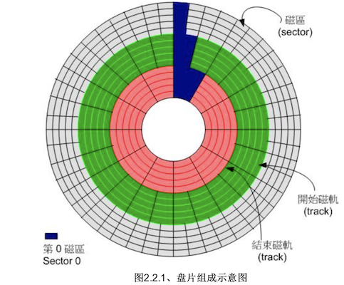
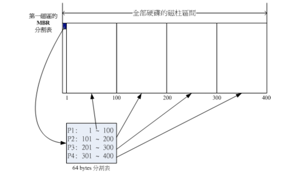
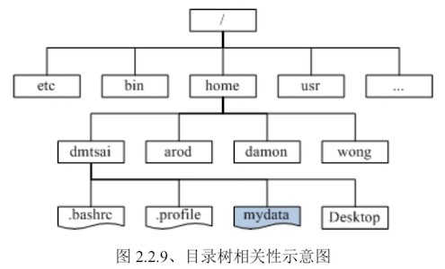
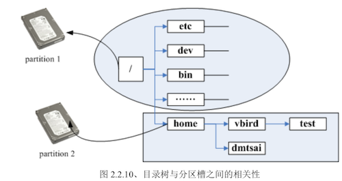

# 磁盘分区
这一章在规划的重点是为了要安装 linux，与 windows 中的  c、d、e 盘不同，linux 的设备是以文件形态存在的

## 磁盘连接的方式与设备文件名的关系

- 正常的实体机一般使用 `/dev/sd[a-]` 的磁盘文件名
- 虚拟机一般会使用 `/dev/vd/[a-p]`

以 SATA 接口来说，由于 SATA/USB/SAS 等磁盘接口都是使用 SCS 模块来驱动的，
因此都是 `/dev/sd[a-p]` 的格式。假设同时存在你的计算机中呢？怎么确定他们各自对应的名称是什么？

确定顺序是按 Linux 核心侦测到的磁盘顺序分配文件名，是检测到的顺序，
比如 USB 是系统启动后才检测到，那么 USB 的文件名就是 `/dev/sdc`

还有一个问题，如果一个磁盘被分区了呢？那么每个分区的设备文件名又是什么？
在了解这个问题之前，需要先复习下磁盘的组成，因为现今磁盘的分区与他物理的组成很有关系

磁盘的组成部分主要有盘片、机械手臂、磁头与主轴马达所组成，数据的写入其实是在盘片上面。
盘片上面有可细分出扇区（Sector）与磁道（Track）两种单位，扇区的物理量设计有 512 Bytes 与 4 KBytes.
假设只有一个盘片，那么盘片有点像下面这样：

整颗磁盘的第一个扇区特别重要，因为记录了整颗磁盘的重要信息，早期磁盘第一个扇区里面含有 MBR(Master Boot Record) 格式，
由于近年来磁盘容量不断扩大，造成读写上的一些困扰，大于 2 TB 以上的磁盘分区已经让某些系统无法存取。
因此后来又多了一个新的磁盘分区格式，称为 GPT（GUID partition table），这两个分区格式与限制相差很大

那么分区表又是什么？上图的磁盘就像一根原木，必须要在上面切割出你想要的区段，这个区段才能制作出你想要的家具，
如果没有进行切割，那么原木就不能被有效的使用。所以需要对硬盘分区才能被使用

## MSDOS（MBR）与 GPT 磁盘分区表（partition table）

上面示例图中，有开始磁道和结束磁道，通常磁盘有多个盘片，所有盘片的同一个磁道我们成为柱面（Cylinder），
通常这是文件的系统的最小单位，也就是最小的分区单位。 但是在 GPT 中，可达到 64 bit 记录功能的分区表，
现在甚至可以使用扇区（sector）号码来作为分区单位了。

所以说就是利用参考对照柱面或扇区号码方式来处理。

### MSDOS (MBR) 分区表格式与限制
早期 Linux 系统为了兼容 Windows 磁盘，使用的是支持 Windows 的 MBR（Master boot record ，开机记录表）
的方式来处理开机管理程序与分区表。

开机管理程序记录区域分区表则通通放在磁盘的第一个扇区，通常是 512 Bytes 大小，第一个扇区 512 Bytes 会有以下两个数据：

- 主要开机记录区（Master Boot Record，MBR）：可以安装开机管理程序的地方，有 446 Bytes
- 分区表（partition table）：记录整颗硬盘分区的状态，有 64 Bytes

由于分区表仅有 64 Bytes，因此最大仅能有四组记录区，每组记录区记录了该区段的 **起始与结束的柱面号码**。
将硬盘以长条形来看，柱面以直条图来看，分区表的示意图如下

假设上面的磁盘设备文件名为 `/dev/sda` 时，那么这四个分区在 linux 中的设备文件名如下所示，
重点在于文件名后面的数字，数字与该分区所在的位置有关

- `p1:/dev/sda1`
- `p1:/dev/sda2`
- `p1:/dev/sda3`
- `p1:/dev/sda4`

由于只有 64 Bytes，最多只能容纳四笔分区记录，这 4 个分区的记录被称为主分区或延伸分区，
根据上面的图示与说明，可以得到几个重点信息

- 其实所谓的分区只是针对那个 64 Bytes 的分区表进行设置而已
- 硬盘默认的分区表仅能写入四组分区信息
- 这四组分区信息称为主要（Primary）或延伸（Extended）分区
- 分区的最小单位「通常」为柱面（cylindr）
- 当系统要写入磁盘时，一定会参考磁盘分区表，才能很对某个分区进行数据的处理

哪为什么需要分区呢？基本上可以这样思考分区的角度：

- 数据的安全性：如 windows 的 c、d、e，你可以抹掉 d 盘数据，但是 e 盘数据不受影响
- 系统的性能考虑：由于分区将数据几种在某个柱面的区段，假设该分区位于柱面号码 1~100 时，那么系统只需要读取 1~100 柱面，有助于数据的读与性能

那既然分区表只有记录四组数据的空间，是否代表一颗硬盘只能分出 4 个区？（笔者也有这个疑问）。

解决这个多分区的方式就是使用延伸分区，如下图所示

::: tip
实际上延伸分区不不是只占一个区块，而是会分布在每个分区的最前面几个扇区来记载分区信息
:::

上图中，P1 为主分区，P2 为延伸分区，延伸分区的目的是 **使用额外的扇区来记录分区信息，延伸分区本身并不能被拿来格式化**，
图右下方分隔出来了 5 个分区，这个被称为 **逻辑分区**（logical partition）

笔者看到这里就明白了，为什么以前在分硬盘的时候，有主分区，延伸（扩展）分区，还需要再分，
图上的关联关系来看，延伸分区的最小柱面单位是 512 Bytes，64 Bytes 可以存储 4 个分区记录，
那么 512 / 64 * 4 = 32 个分区记录，这就能分很多区了

同样的，上述的分区在 Linux 系统中的设备文件名分分别如下：

- `P1:/dev/sda1`
- `P1:/dev/sda2`
- `L1:/dev/sda[5-9]`

为啥从 5 开始了？前 4 个分区是保留给固定的 4 个分区用的。

MBR 主要分区、延伸分区与逻辑分区的特性简单定义：

- 主要分区与延伸分区最多可以有 4 个（硬盘限制）
- 延伸分区最多只能有一个（操作系统限制）
- 逻辑分区是由延伸分区持续切割出出来的分区

  延伸分区不可格式化，作为数据存取的分区主要为 主要分区和逻辑分区
- 逻辑分区的数量依操作系统而不同，linux 中 sata 硬盘已经开源突破 63 个以上的分区限制

由以上知识来看，分区表很重要，主分区与 MBR 更重要，几乎只要读取硬盘都会先由这个扇区先读起，
所以当第一个分扇区物理实体坏掉时，基本上这个硬盘就毁了。

经过以上的学习后，就会发现 MBR 分区表的限制中经常可以发现如下的问题

- 操作系统无法抓取到 2.2 T 以上的磁盘容量（笔记没有看懂这条，怎么就无法了？）
- MBR 仅有一个区块，若被破坏后，经常无法或很难救援
- MBR 内存放开机管理程序的区块仅为 445 Bytes，无法容纳较多的程序码

### GUID partition table，GPT 磁盘分区表

为了解决 MBR 的限制，出现了 GPT 。过去一个扇区只有 512 Bytes，目前已经有 4 K 扇区设计出现了。
为了兼容所有的磁盘，在扇区定义上大多会使用所谓的逻辑区块位置（Logical Block Address，LBA）来处理。
GPT 将磁盘所有区块以 LBA（默认为 512 Bytes）来规划，第一个 LBA 称为 LBA 0

GPT 使用了 34 个 LBA 区块来记录分区信息，同时整个磁盘最后 33 个 LBA 也拿来作为另一个备份，
就解决了 MBR 第一个扇区坏掉就不能读取的情况了，类似下图示意

上图个区解释如下：

- LBA0（MBR 相容区块）

  前 446 byte 存放开机管理程序，兼容 MBR，而原本的分区表的记录区放入一个特殊标识，表示是 GPT 格式，
  而不动 GPT 分区表的磁盘管理程序则不能识别该磁盘
- LBA1（GPT 表头记录）

  记录了分区表本身的位置与大小与被备份分区的存放位置，同时放置了分区表的校验机制码（CRC32),
  操作系统可以根据这个校验码来判断 GPT 是否正确。若有错误，则可通过这个记录区来取得备份的 GPT,
  来回复 GPT 的正常运行
- LBA2-33（实际记录分区信息处）

  从 LBA2 开始，每个 LBA 都可以记录 4 笔分区记录，在默认情况下总共可以有 4*32=128 笔分区记录，
  每个 LBA 有 512 Bytes，每笔记录用到 128 Bytes 的空间，除了每笔记录所需要的识别码与相关的
  记录之外， GPT 在每笔记录中分别提供了 64 bits 来记载开始/结束的扇区号码，
  因此，GPT 分区表对于单一分区来说，他的最大容量限制就会在「2^64 * 512 Bytes = 2^63 * 1 KBytes = 2^33 TB = 8 ZB,1 ZB = 2^30TB」

  笔者看不懂，反正就知道 GPT 单个分区可以很大很大

  linux kernel 通过 udev 等方式处理，没有分区限制了，想分多少分多少，
  而且 GPT 分区没有主、延伸、逻辑分区的概念，每笔记录都可以独立存在，可视为都是主分区，都能单独格式化

  反正也不太能看懂，总结下就是：

  - GPT 分区默认可以提供 128 笔记录（是有 128 个分区吗？）
  - Linux 内核通过 udev 方式，可以突破这限制
  - GPT 没有主、延伸、逻辑分区概念
  - 有网友测试分了 130+ 的分区，前 120 个都可以格式化使用，后面的视乎不行

虽然新版 Linux 大多能识别 GPT 分区，但是有部分软件不识别，如 fdsk，需要使用 gdsk、parted 指令（后面会讲解），
另外开机管理程序方面，grup 第一版不支持，grup2 才支持（后面会讲解）

不是所有的操作系统都可以读取到 GPT 的磁盘分区格式，也不是所有的硬件都支持 GPT 格式，
是否能够读写 GPT 格式与开机检测程序有关（BIOS 与 UEFI）

## 开机流程中的 BIOS 与 UEFI 开机检测程序
之前讲到，没有执行软件的硬件是没有用的，那么操作系统也是软件，开机时计算机还没有任何算计系统，
那么机器是如何读取硬盘内的操作系统文件的？这个就是开机程序的工作了

目前主机系统在载入硬件驱动方面的程序，主要有早期的 BIOS 与新的 UEFI 两种机制。

### BIOS 搭配 MBR/GPT 的开机流程

1. BIOS：开机主动执行的固件，会认识第一个可开机的设备
2. MBR：第一个可开机设备的第一个扇区内的组要开机记录区块，内含开机管理程序
3. 开机管理程序（boot loader）：载入核心文件
4. 核心文件：开始操作系统的功能

所以如果你的 BIOS 支持 GPT的话，那么就能够从 LBA0 的 MBR 相容区块读取第一阶段的开机管理程序码，
从而识别 GPT 格式的分区表

::: tip
由于 LBA0 仅提供第一阶段的开机管理程序码，因此如何使用类似 grub 的开机管理程序的话，
就需要额外分区出一个「BIOS boot」的分区来放置其他开机过程中所需的程序码，
在 CentOs 中一般占用 2 MB 左右
:::

BIOS 与 MBR 都是硬件本身会支持的功能，Boot loader 则是操作系统安装在 MBR 上面的一套软件。
由于 MBR 仅有 446 Bytes，因此开机管理程序是非常小而美的。
boot loader 的主要任务有以下几项：

- 提供菜单：使用者可以选择不同的开机项目，这也是多重开机的重要功能
- 载入核心文件：直接指向可开机的程序区段来开始操作系统
- 转交其他 loader：将开机管理功能转交给其他的 loader 负责

第三条怎么理解？硬盘不只有一个 MBR ，开机管理程序除了可以安装在 MBR 之外，还可以安装在每个分区的
开机扇区（boot sector），这个就是「多重开机」的功能

就是一块硬盘安装多个系统，比如 同时存在 windows 与 linux 系统，总结如下：

- 每个分区都拥有自己的开机扇区（boot sector）
- 实际可开机的核心文件是放置到各分区的
- loader 只会认识自己的系统盘内的可开机核心文件，以及其他的 loader 而已
- loader 可直接指向或则是间接将管理权转交给另一个管理程序

大家常说「如果安装多系统，最好先安装 windows 再安装 linux」这是因为：

- linux 在安装的时候，可以选择将开机管理程序安装在 MBR 或各分区的开机扇区，而且可以在  linux 的 boot loader 里面加入 windows 开机的选项
- windows 安装的时候，会主动覆盖掉 MBR 以及自己所在分区的开机扇区，你没有选择的机会，而且没有让我们自己选择菜单的功能

那么先安装 linux，后安装 windows，MBR 中的 linux 开机管理程序被覆盖掉后，只能重装 linux 一条路吗？
当然不是，还可以利用 linux 的救援模式来挽救 MBR

::: tip
开机管理程序与 Boot secrot 的观念非常重要，后面会仔细讲解
:::

### UEFI BIOS 搭配 GPT 开机的流程

MBR 的 BIOS 太落后了，出现了使用 C 写的 UEFI（Unified Extensible Firmware Interface）
统一可延伸固件界面

UEFI 主要是想取代 BIOS 固件，也称为 UEFI BIOS，如果开发者够厉害，可以在开机阶段就让该系统
了解 TCP/IP 而直接上网，根本不需要进入操作系统，这让小型系统的开发充满各式各样的可能性

基本上，传统 BIOS 与 UEFI 的差异可以用下表来说明

比较项目               | 传统 BIOS                                                   | UEFI
-----------------------|-------------------------------------------------------------|-------------------
使用程序语言           | 组合语言                                                    | C 语言
硬件资源控制           | 使用终端（IRQ)管理，不可变的内存存取，不可变的输入/输出存取 | 使用驱动程序与协定
处理器运行环境         | 16 位                                                       | CPU 保护模式
扩充方式               | 通过 IRQ 链接                                               | 直接载入驱动程序
第三方厂商支持         | 较差                                                        | 较佳且可支持多平台
图形化能力             | 较差                                                        | 较佳
内置简化操作系统前环境 | 不支持                                                      | 支持

通过上表，UEFI 就像是一个低阶的操作系统，连主板上面的硬件资源管理都与操作系统类似。

笔者感觉好复杂的 UEFI，总之目前 UEFI 一般用来作为启动操作系统之前的硬件检测、开机管理、软件设置等目的，
当载入系统后，就停会停止工作，将系统交给操作系统。

此外，由于过去 cracker 经常借由 BIOS 开机阶段来破坏系统，并取得控制权，因此 UEFI 加入了一个
安全启动（**secure boot**）机制，表示即将开机的操作系统必须被 UEFI 所验证，否则就无法顺利开机，
微软用了很多这样的机制来管理硬件。

不过有些时候可能启用该机制之后，无法进入 windows 或则 linux，需要关闭

UEFI 可以直接去的 GPT 分区表，不过最好依旧拥有 BIOS boot 的分区支持，同时，为了与 windows 相容，
并且提供其他第三方厂商所使用的 UEFI 应用程序存储的空间，你必须格式化一个 vfat 的文件系统，
大约提供 512 MB ~ 1G 左右的容量，以让其他 UEFI 执行较为方便

::: tip
由于 UEFI 克服了 BIOS 的 1024 柱面的问题，因此你的开机管理程序与核心放置磁盘开始前 2 TB
位置内即可，加上之前提到的 BIOS boot 以及 UEFI 支持的分区，基本上你的 `boot` 目录
几乎都是 `/dev/sda3` 之后的号码了，这样开机还是没有问题的，

与之前熟悉的分区状态已经不同， /boot 不再是 /dev/sda1 了
:::

### Linux 安装模式下，磁盘分区的选择（及其重要）
在 windows 上重装系统的时候，一般会考虑 c 盘多少容量，d 盘给多大容量，在实际安装的时候，
C 盘之前就会有个 100 MB 的分区被独立出来了，所以实际上就有 3 个分区了，
那 linux 下又该如何设计类似的东西呢？

#### 目录树结构（directory tree)
linux 下所有的数据都是以文件的形态来呈现的，所以最重要的就是目录树架构

所有文件都是由根目录「/」衍生而来的，上图长方形为目录，波浪形为文件，比如想要取得 mydata 那个文件时，
系统就得由根目录开始找，查找就形成了一条路径 `/home/dmtsai/mydata`

linux 系统使用的是目录树架构，但是我们文件数据其实是放置在磁盘分区槽当中的，
现在的问题是「如何结合目录树的架构与磁盘内的数据呢」？这个时候就需要用到「挂载（mount）」了

#### 文件系统与目录树的关系（挂载）

**挂载** 就是利用一个目录当成进入点，将磁盘分区槽的数据放置在该目录下。
也就是说，进入该目录就可以读取该分区槽的意思，这个动作我们成为挂载。

由于整个 Linux 系统最重要的就是根目录，因此根目录一定需要挂载到某个分区槽的，
至于其他的目录则可依据用户自己的需求来挂载到不同的分区槽

- partition 1 挂载到根目录下
- partition 2 挂载到 /home 下

也就是说，当把数据放置在 /home 下时，是放在了 partition 2 上的，否则就是放在 partition 1 上的

#### distribution 安装时，挂载点与磁盘分区的规划

在安装 linux 系统时，必要要经历的就是磁盘分区了，一般都会内置好几种分区方式，
但是可能满足不了你需求，那么久可以使用「自定义模式（custom）」，有些 distribution 会把自定模式写成
「专家模式（Expert）」

- A: 初次接触 Linux：只要分区 「/」及「swap」即可

  原因是怕分错导致无法安装的困境，比如 /usr 是 linux 的可执行程序以及先关的文件摆放目录，
  所以对容量需求蛮大的，万一分小了，就安装不了了
- B：建议分区的方法：预留一个备用的深入磁盘容量

  在学习 linux 过程中，最麻烦的可能就是得常常处理分区的问题，如果你将整个硬盘的容量都用光了，
  那么要如何联系分区功能呢？

  另外，预留的分区槽也可以拿来作为备份用，比如你需要重装系统时，把一些重要的脚步备份到这个备用分区中，
  重装的时候就可以立马找到他们
- 选择 Linux 安装程序提供的默认硬盘分区方式

  对于首次接触 linux 的朋友们，通常不建议使用 distribution 所预设的 server 安装方式，
  因为会让你无法得知 linux 在搞什么，而且需要注意的是，选择 server 的时候，会自动把你硬盘里面所有的数据全部抹掉
